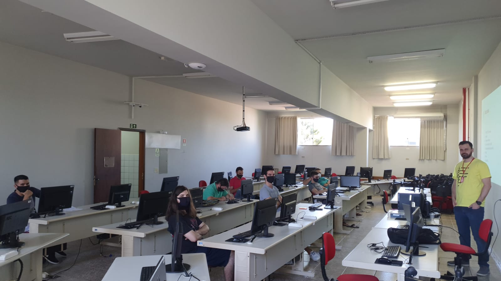

**13/03/2021 - Aula introdutoria**

Hoje foi a primeira aula da pós, mas não teve muita coisa.
A situação atual é que a pandemia está piorando, e está aumentando o numero de casos de COVID-19 na cidade.

Com isso parte dos alunos não se sentiu confortável para ir no primeiro dia, no qual o professor fez duas reuniões, uma aconteceu presencialmente na Unipar pela manha e no período da tarde teve outra reunião utilizando o Meet.

Essas reuniões foram utilizadas para apresentar informações gerais sobre a pós, matérias, calendário, professores e a situação atual da pandemia, o que fazer caso tiver algum decreto proibindo as aulas.

No geral foi informações do andamento e conhecer alguns dos alunos.

